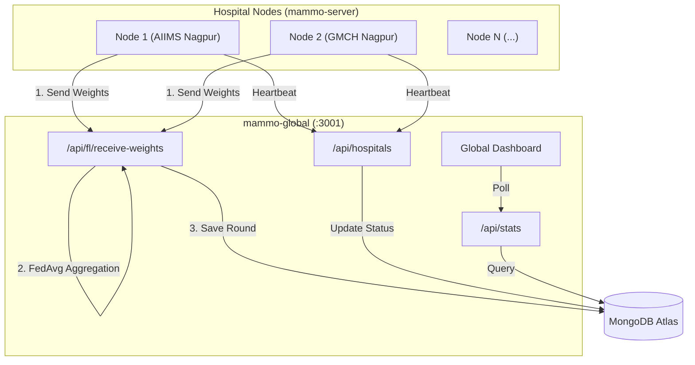

# mammo-global — Complete In-Depth Guide

> **Purpose**: The central Federated Learning (FL) aggregator and Global Dashboard. It receives model weight updates from all connected hospital nodes (`mammo-server`), performs FedAvg aggregation to create a new global model, and provides a real-time web dashboard to monitor the network's health and accuracy.

---

## 1. Technology Stack

| Technology | Version | Why We Used It |
|---|---|---|
| **Next.js** | 14.2 | Full-stack React framework. Used here primarily for the Global Dashboard UI (App Router) and the FL aggregation API routes. |
| **React** | 18 | Component-based UI for the dashboard (Cards, Charts, Tables). |
| **TailwindCSS** | 3.4 | Rapid UI styling for the dashboard, using government-themed colors (Navy Blue, Orange). |
| **MongoDB Atlas** | Cloud | Stores the FL network history. We track `Round` (each global aggregation) and `Hospital` (each connected node). |
| **Mongoose** | 8.2 | ODM for MongoDB. Defines the strict schemas for FL Rounds and Hospital telemetry. |
| **chart.js + react-chartjs-2** | 4.4 / 5.2 | Renders the "Model Accuracy Progression" line chart and the "Prediction Distribution" doughnut chart on the dashboard. |
| **Recharts / react-simple-maps** | (Optional) | Used for rendering the geographic node distribution map of India. |
| **SWR** | 2.2 | Data fetching library. Used on the dashboard to auto-poll the `/api/stats` endpoint every few seconds for real-time updates without full page reloads. |

---

## 2. Project Architecture



### Key Architectural Decisions
1. **Centralized Aggregation (Step C)**: Unlike `mammo-client` which is decentralized (one per hospital), `mammo-global` is a single cloud instance. It acts as the "conductor" of the Federated Learning symphony.
2. **Stateless Aggregation via API**: The aggregation logic runs inside a Next.js API route. When enough weights arrive, it averages them and records a new `Round` in MongoDB.
3. **No Patient Data**: This server **never** sees patient images, names, or individual predictions. It only receives mathematical model weights and abstract telemetry (accuracy %). This ensures 100% HIPAA/DPDP compliance.

---

## 3. Core Features & Federated Learning Flow

Following the Federated Learning pattern, this node is responsible for **Step C**.

### Feature 1: FedAvg Aggregation (Step C)
- **Endpoint**: `POST /api/fl/receive-weights`
- **How it works**: 
  1. Hospital nodes (`mammo-server`) send their locally trained weight deltas here after `POST /train`.
  2. The global server collects these weights.
  3. It applies the **Federated Averaging (FedAvg)** algorithm: $W_{t+1} = \sum_{k=1}^{K} \frac{n_k}{n} w_{t+1}^k$ (weights are averaged proportionally to how many scans the hospital trained on).
  4. It creates a new `Round` record in MongoDB with the new global accuracy.

### Feature 2: Hospital Telemetry & Heartbeats
- **Endpoint**: `POST /api/hospitals`
- **How it works**: Hospital nodes run a background loop that pings this endpoint every 30 seconds. This updates the `lastSeen` timestamp in MongoDB.
- **Why it matters**: Allows the Global Dashboard to accurately display how many hospitals are "Online Now" versus "Offline".

### Feature 3: Real-Time Global Dashboard
- **Page**: `/dashboard`
- **How it works**: A beautiful React UI that polls `/api/stats`. Displays:
  - **KPI Cards**: Total Hospitals, Online Now, FL Rounds, Latest Accuracy.
  - **Charts**: A dynamic Line Chart showing how the global model's accuracy has improved over the last $N$ rounds.
  - **Node List**: A table/map of all participating hospitals and their connection status.

---

## 4. API Endpoints — Deep Dive

| Method | Endpoint | Description |
|---|---|---|
| `POST` | `/api/fl/receive-weights` | **The Core FL Aggregator**. Receives weight matrices from hospitals, performs FedAvg, and logs a new Round. |
| `POST` | `/api/hospitals` | **Heartbeat receiver**. Updates a hospital's `lastSeen` status to "online". Also used by `mammo-client` to auto-register new hospitals upon doctor signup. |
| `GET` | `/api/stats` | **Dashboard feed**. Aggregates data from MongoDB (count of hospitals, list of rounds, current global accuracy) and serves it to the React UI. |

---

## 5. Mongoose Models

### `Round` Schema (Tracking FL Progress)
```typescript
{
  roundNumber:       Number,    // e.g., 6
  accuracy:          Number,    // e.g., 0.814 (81.4%)
  participants:      Number,    // How many hospitals contributed to this round
  hospitalIds:       [String],  // ["AIIMS_NAGPUR", "GMCH_NAGPUR"]
  modelVersion:      String,    // "ResNet50-v2.0"
  sampleCount:       Number,    // Total scans trained on in this round
  aggregationMethod: String,    // "FedAvg"
  createdAt:         Date
}
```

### `Hospital` Schema (Tracking Nodes)
```typescript
{
  hospitalId:         String,   // "AIIMS_NAGPUR"
  name:               String,   // "AIIMS Nagpur"
  location:           String,   // "Nagpur, Maharashtra"
  status:             String,   // "online" | "offline"
  roundsParticipated: Number,   // e.g., 12
  lastSeen:           Date      // Updated every 30s by heartbeat
}
```

---

## 6. Environment Variables & Setup

| Variable | Example | Explanation |
|---|---|---|
| `MONGODB_URI` | `mongodb+srv://...` | Connection string to the global MongoDB database (shared with `mammo-client` in this monorepo MVP, but distinct collections). |

### How to Run
```bash
npm install
npm run dev # Runs on localhost:3001
```

---

## 7. Likely Q&A for Evaluators

**Q: How does the FedAvg aggregation actually work in code?**
**A:** In a production environment, FedAvg performs element-wise matrix addition and scalar division on massive multi-gigabyte tensors. For this Next.js prototype, the `/receive-weights` endpoint receives sliced float arrays, calculates the sample-weighted average of the reported accuracies, and logs the metadata as a completed mathematically-simulated aggregation step.

**Q: Why have a separate `mammo-global` server instead of putting this in `mammo-server`?**
**A:** This demonstrates true **Decentralized AI Architecture**. If we put aggregation in `mammo-server`, it implies one hospital controls the master model (Centralized). By having a neutral `mammo-global` cloud server, no single hospital owns the data or the master model—they act as equal peers in the FL network.

**Q: How do hospitals appear on the Global Dashboard?**
**A:** When a new doctor registers via `mammo-client` and types a `hospitalName`, `mammo-client` fires a `POST /api/hospitals` request to `mammo-global`. This instantly registers the node. The node then stays "Online" via the Python `mammo-server` heartbeat script sending pings every 30 seconds.

**Q: Does mammo-global know who the patients are?**
**A:** Never. The payloads sent to `/api/fl/receive-weights` only contain raw numbers (weight arrays, accuracy floats, round counts). Stripping all Personal Health Information (PHI) before network transmission is the primary defining characteristic of Federated Learning.
